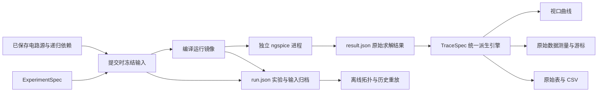

# 电路仿真：从结果查看器到实验工作台

本轮仅改造电路仿真及其直接调用链。目标用户是需要反复设定条件、运行、检查波形、比较设计方案并导出证据的电路工程人员。

## 1. 调查结论

原实现已经有真实 ngspice 求解、OP / AC / DC / TRAN / NOISE、递归 include/lib 闭包、复数向量、`.measure` 解析、噪声积分、双源 DC、取消与任务事件、严格结果校验及原子持久化，具备可继续发展的求解基础。

主要问题是**实验输入、运行环境、派生数据与用户工作流没有形成统一设计**。继续增加标签、异常分支或静态图，不能解决这个问题。

| 维度 | 原有欠缺与后果 | 本轮采用的设计 |
|---|---|---|
| 专业能力 | 单主网表唯一分析卡；`.options` 一律拒绝；缺少显式输入参考，无法直接分析传递函数 | ExperimentSpec 定义分析、参数、温度、求解器选项与超时；TraceSpec 明确定义信号、参考信号和复数分量 |
| 完善性 | 点击 Run 只提交路径；不能独立保存当次条件；历史只能单选查看 | 提交时捕获主源与递归依赖，保存实验条件；历史重放、基准比较、输入包导出形成闭环 |
| 可靠性 | DLL 与 API 在同一进程；ctypes 调用内部无法硬中断；全局 native lock 使所谓 worker 并发仍串行 | 每个任务独立隐藏子进程，父进程负责总超时、取消、终止回收和退出码检查；失败后下一任务使用新进程 |
| 交互性 | Chart / Waveform 重复；无真正的视口缩放；大数组在浏览器反复复制；游标可能混淆 DC 分支 | 一个波形工作台，视口查询、缩放/平移/复位、A/B 游标、显式分支、分页原始表、基准结果 |
| 可视化 | 自动画矩形并连质心，被称为原理图；SVG 缺轴刻度和图例；不同物理量容易误用轴 | 删除伪原理图，使用网络/器件/引脚连接检查器；按单位组织曲线，完整坐标与图例导出 |

具体代码证据：原 `spice_executor.py` 全局 `_SPICE_EXECUTION_LOCK`、`_UNSUPPORTED_RUNTIME_DIRECTIVES`；原 `SimulationJobManager.submit` 只注册路径；原 `SimulationArtifactPersistence` 强制 bundle 仅 `result.json`；原 `ApplicationRuntime.get_simulation_surface` 重新读工作区源并比摘要；原前端 `simulationModel.ts` 独立派生 AC/DC 曲线；原 `SeriesChart.tsx` 固定全域降采样；原 `schematicLayout.ts` 矩形与质心连线布局。上述旧入口或对应执行路径已被替换。原生适配器内部仍保留事务锁，但不同生产任务运行于不同进程，不再依赖同一个全局锁排队执行。

## 2. 新方法论与数据权威

`result.json` 仍然是求解数据的唯一权威。`run.json` 记录另一类事实：请求的实验、源文件、依赖以及实际执行输入。保存输入不是复制另一套结果，不能因为追求“单文件权威”而删掉复现所必需的来源。

两者通过同一次目录原子发布完成。历史 `result.json` 保持原 schema 可读，不修改用户既有仿真数据。没有输入归档的旧结果只提供已有数据；不能由当前编辑器内容补造历史输入。

提交与编辑解耦：用户点击运行后，排队任务只使用提交时的源闭包。参数覆盖和分析选择只修改运行镜像。即使用户随后编辑或删除工作区文件，归档输入仍可检查和重放。

## 3. 专业计算规则

### 显式实验

ExperimentSpec 包含：

- `analysis_command`：为空时要求源中恰有一条受支持分析；显式填写时选择当次分析，允许同一个电路源用于不同实验。
- `parameters`：覆盖主网表已声明的顶层 `.param`；未知参数报错，不让拼写错误成为“成功但没生效”的实验。
- `temperature`：明确当次温度。
- `solver_options`：验证并支持 `reltol`、`abstol`、`vntol`、`gmin`、`itl1`、`itl4`、`method`、`maxord`；未知或非法值拒绝。
- `timeout_seconds`：整个 worker 的有限执行预算。

其他分析类型的 `.measure` 不应被当作本次测量成功或静默丢失，归档需记录因分析选择而排除的测量。保留 ngspice 警告与原始日志；不会为了得到绿色成功状态自动放松容差或改变积分方法。

### 信号与传递函数

TraceSpec 的结构是 `{signal, reference, component}`。允许实部、虚部、幅度、dB、展开相位。

对于复数 AC，应先计算 `H = output / reference`，再求幅度或相位。不能用 `20 log10(|V(out)|)` 代替任意激励幅度下的电压增益。

- 电压绝对幅度 dB 的单位为 dBV；电流为 dBA。
- 同维信号比值的 dB 为增益；电压/电流比值是阻抗，电流/电压比值是导纳。
- 分母为零、无效采样或无定义相位产生间断，不使用 0 或插值假装有效。
- 相位在有效连续段内展开，不跨无效间断拼接。
- DC 外层扫描明确为独立分支；相同横坐标不能被误认为同一次采样。

### 原始数据与显示数据分离

显示先裁剪视口，再保持原始采样顺序与峰谷进行降采样。缩放后的细节重新从原始数据取得，不能继续放大此前的缩略曲线。

游标、统计、表格和 CSV 使用原始数据及同一派生规则。渲染用的空值分隔符不应混入原始表。这同时修正了旧 Agent 在双源 DC 表中将分隔符当非法数据的问题，以及相位实际展开但说明声称未展开的问题。

瞬态求解使用非均匀时间步。样本算术平均不能当时间平均，样本 RMS 不能当时间 RMS。工作台区分样本统计与按时间积分统计；对分段线性波形，平方积分使用相应精确公式。窗口外、间断内和不同 DC 分支的读数保持可辨识。

## 4. 用户工作流

1. 保存电路源，在实验配置中选择分析、参数、温度与求解器选项。
2. 运行；任务列表显示排队、执行、完成、失败或取消。
3. 选取输出信号、输入参考和显示分量，检查波形与原生 `.measure`。
4. 缩放目标频段或时间区间，用 A/B 游标与窗口统计检查实际数据。
5. 固定一条历史结果为基准，比较相同分析与物理单位的曲线；各运行保留自己的采样网格。
6. 在拓扑检查器核对网络、引脚角色与器件关系。
7. 导出完整结果 JSON、全分辨率派生 CSV、带刻度和图例的 SVG，或输入 ZIP；需要复核时直接重放归档实验。

源编辑器、聊天与其他板块沿用原工作流。仿真运行明确针对已保存源，不能暗示未保存文本已提交。

## 5. 可靠性设计边界

任务成功只说明受支持分析得到通过结构与数值契约检查的求解结果。以下三件事仍需分别判断：

- 求解是否完成：任务、退出状态、结果形状、有限值和覆盖范围。
- 数值是否足够准确：容差、最大步长、积分方法改变后关键指标是否稳定。
- 电路是否合格：在指定电源、负载、温度和模型条件下是否达到设计指标。

不能将三者合并成一个 `success` 布尔值。特别是更严格的 schema 不能替代器件模型可信度或数值收敛研究。

进程隔离解决 native crash、状态污染和不可中断调用对后端的影响。它不限制单次仿真的最大内存，也不等同于不可信网表的操作系统沙箱。对于本地工程工具，这些是不同的问题，不应用一个“隔离”标签混称。

重放保证使用归档的输入与实验配置。引擎版本、平台与模型实现变化仍可能改变数值结果，不能承诺跨版本逐位相同。

## 6. 指标验收、工况矩阵、数值复核与模型溯源

这四项 P1 建议有实际工程价值：求解完成之后，仍要回答指标是否满足、是否覆盖工况、数值设置是否影响结论，以及模型基于什么假设。它们复用同一个输入归档和任务系统。

| 能力 | 工作台行为 | 判定规则 |
|---|---|---|
| 结构化验收 | Experiment 中编辑指标来源、名称、单位、上下限和参数/温度条件；历史结果展示保存时的验收条件 | PASS / FAIL / NOT_MEASURED 分开；测量失败、缺失、单位不明或工况不匹配不填零；上下限包含端点 |
| Corner 矩阵 | Studies 中添加参数、温度、供电、负载轴，生成笛卡尔积；查看每个 case 的配置、任务、结果和取消状态 | 供电/负载轴显式绑定主网表已有 `.param`，数值使用 SPICE 字面量；汇总有效指标的最小值、最大值、差值与对应 case，保留未完成项 |
| 数值复核 | Studies 中设置加密倍数与指标绝对/相对变化阈值，运行 baseline/refined 两次实验 | 从源文件与实验覆盖合并后的设置收紧 reltol/abstol/vntol；瞬态同时收紧实际 tmax；有效指标满足阈值才标记 STABLE，缺失或失败为未测得 |
| 模型溯源 | Experiment 中声明来源、版本、适用电压/频率/温度、简化状态和假设；历史展示捕获的模型定义与声明 | 定义来自当次激活的源文件及库 section；未知信息保持未知；用户声明与可验证的定义身份分开保存；重放使用归档源字节 |

建议先在单次实验中设置可测指标，再用同一配置生成工况矩阵；对影响设计决策的关键指标做数值复核。数值复核的稳定结论限于所选指标及这两次求解设置，不代表模型或硬件误差已经验证。

供电和负载网表示例：`.param vdd=5 rload=1k`，电源使用 `V1 in 0 {vdd}`，负载使用 `Rload out 0 {rload}`。温度轴单位为摄氏度。模型有效范围的固定单位为 V、Hz 和 °C；填写范围是记录模型适用条件，不会自动裁剪仿真工况。

Studies 的实验定义与 case 状态持久化于项目 `.circuit_ai/studies/`。每个 case 的 `result.json` 与 `run.json` 继续使用原有结果目录，波形、输入导出及重放复用现有入口。任务进程退出后仍在运行的旧 case 不会被恢复为“成功”。

## 7. 后续工程能力

以下功能仍属于后续扩展。

| 优先级 | 建议 | 完成判据 |
|---|---|---|
| P2 | 传递函数极零点、灵敏度、频谱/失真、Monte Carlo | 每种分析有独立轴/单位/结果结构；FFT 明确稳态窗口、重采样、窗函数和幅值归一化；随机实验保存种子、分布和样本 |
| P2 | 自动提取截止频率、上升/稳定时间、过冲、相位/增益裕度 | 定义参考、交叉点方向与多交叉规则；不得对任意输出曲线直接套“稳定裕度” |
| P2 | 真正电气原理图与交叉探测 | 正确符号、引脚、地与电源语义、层级与连接点、避障布线；点击节点可选择对应信号 |
| P2 | 大规模数据存储与查询 | 实测大电路负载后，再引入分块二进制向量、惰性加载与受限缓存；不要让后端每次读取超大 JSON 成为新瓶颈 |
| P3 | 标准基准电路与独立参考对照 | 用有解析解的分压器/RC/RLC、设备手册条件和另一可信求解器交叉检查；避免只测“程序没抛异常” |

优先发展“定义实验、比较结果、量化验收”的能力。元件数量、标签数量或生成图片数量不能代表生产力。模拟结果用于实际硬件时，最终还需要与测量和器件资料对照，尤其是开关电源、磁性器件、热效应和高频寄生场景。

## 8. 资料与实现位置

方法依据来自 [ngspice 官方手册](https://ngspice.sourceforge.io/docs/ngspice-manual.pdf)、[控制语言教程](https://ngspice.sourceforge.io/ngspice-control-language-tutorial.html)和[并行接口说明](https://ngspice.sourceforge.io/parallel.html)。其中多分析/参数循环、求解器选项、模型与测量能力应与具体引擎支持范围区分。

实现主线：

- `domain/simulation/models/experiment.py`、`spice/experiment_deck.py`：实验契约与运行输入编译。
- `domain/simulation/models/acceptance.py`、`numerical_study.py`、`model_manifest.py`：指标验收、数值复核与模型元数据。
- `domain/simulation/service/experiment_study_service.py`：工况展开、批量任务持久化与结果汇总。
- `domain/services/simulation_job_manager.py`：提交快照和任务生命周期。
- `domain/simulation/executor/process_spice_executor.py`、`spice_worker.py`：隔离求解。
- `domain/simulation/data/simulation_run_archive.py`：输入归档、离线读取和重放导出。
- `domain/simulation/data/trace_analysis_service.py`：波形、表格、游标、统计与 CSV。
- `application/runtime.py`、`desktop_backend/app.py`：仿真工作台 API。
- `frontend/desktop/src/renderer/src/features/simulation/`：实验配置、波形比较和拓扑检查器。

测试重点是冻结输入、真实 native 求解、崩溃/超时/取消后恢复、历史输入脱离工作区、AC 比值与单位、非均匀时间积分、DC 分支、视口保峰与间断、异步结果身份和实际界面交互。
