# 电路AI设计助理 - 项目架构图

> 本文档基于开发阶段文档生成，包含系统整体架构、各层模块关系、数据流转等详细架构图。

---

## 1. 系统整体架构

```mermaid
graph TB
    subgraph Presentation["表示层 (Presentation)"]
        MW[MainWindow<br/>主窗口]
        FB[FileBrowserPanel<br/>文件浏览器]
        CE[CodeEditorPanel<br/>代码编辑器]
        CP[ConversationPanel<br/>对话面板]
        SP[SimulationPanel<br/>仿真结果面板]
        IP[InfoPanel<br/>统一信息面板]
        SV[SchematicViewer<br/>电路图查看器]
        DT[DevToolsPanel<br/>调试面板]
    end

    subgraph Application["应用层 (Application)"]
        BS[Bootstrap<br/>启动引导器]
        PS[ProjectService<br/>项目服务]
        WF[DesignWorkflow<br/>工作流编排]
        
        subgraph Graph["LangGraph 工作流"]
            GS[GraphState<br/>状态容器]
            DGN[DesignGoalsNode<br/>设计目标节点]
            IDN[InitialDesignNode<br/>初始设计节点]
            SN[SimulationNode<br/>仿真节点]
            AN[AnalysisNode<br/>分析节点]
            UCN[UserCheckpointNode<br/>用户检查点]
            FWN[FreeWorkNode<br/>自由工作节点]
        end
        
        TE[ToolExecutor<br/>工具执行器]
        TR[ToolRegistry<br/>工具注册表]
    end

    subgraph Domain["领域层 (Domain)"]
        subgraph Services["无状态领域服务"]
            DS[DesignService<br/>设计目标服务]
            SS[SimulationService<br/>仿真服务]
            CS[ContextService<br/>对话历史服务]
            RS[RAGService<br/>检索服务]
            IHS[IterationHistoryService<br/>迭代历史服务]
        end
        
        subgraph LLM["LLM 集成"]
            CM[ContextManager<br/>上下文管理]
            PTM[PromptTemplateManager<br/>模板管理]
            ESM[ExternalServiceManager<br/>外部服务管理]
            LC[LLMClients<br/>LLM客户端]
        end
        
        subgraph Simulation["仿真引擎"]
            ER[ExecutorRegistry<br/>执行器注册表]
            SE[SpiceExecutor<br/>SPICE执行器]
            ME[MetricsExtractor<br/>指标提取]
            CG[ChartGenerator<br/>图表生成]
        end
        
        subgraph Knowledge["知识检索"]
            ES[EmbeddingService<br/>嵌入服务]
            VS[VectorStore<br/>向量存储]
            CI[CodeIndexer<br/>代码索引]
            RET[RetrievalService<br/>检索服务]
        end
    end

    subgraph Infrastructure["基础设施层 (Infrastructure)"]
        FM[FileManager<br/>文件管理器]
        AFO[AsyncFileOps<br/>异步文件操作]
        CFG[ConfigManager<br/>配置管理]
        CRED[CredentialManager<br/>凭证管理]
        LOG[Logger<br/>日志管理]
    end

    subgraph Shared["共享内核层 (Shared)"]
        SL[ServiceLocator<br/>服务定位器]
        EB[EventBus<br/>事件总线]
        SS[SessionState<br/>会话状态]
        EH[ErrorHandler<br/>错误处理]
        ATR[AsyncTaskRegistry<br/>异步任务注册]
        PM[ProcessManager<br/>进程管理]
        TC[TracingContext<br/>追踪上下文]
    end

    subgraph External["外部系统"]
        NG[ngspice<br/>仿真引擎]
        LLM_API[LLM APIs<br/>智谱/DeepSeek等]
        CDB[ChromaDB<br/>向量数据库]
        SQL[SQLite<br/>检查点存储]
    end

    %% 层间依赖
    Presentation --> Application
    Application --> Domain
    Domain --> Infrastructure
    Application --> Shared
    Domain --> Shared
    Infrastructure --> Shared

    %% 外部系统连接
    SE --> NG
    LC --> LLM_API
    VS --> CDB
    GS --> SQL

---

## 2. 四层架构详细图

```mermaid
graph LR
    subgraph P["表示层"]
        direction TB
        P1[主窗口框架]
        P2[面板组件]
        P3[对话框]
        P4[ViewModel]
    end

    subgraph A["应用层"]
        direction TB
        A1[启动引导器]
        A2[项目服务]
        A3[LangGraph工作流]
        A4[工具执行框架]
        A5[Worker协程]
    end

    subgraph D["领域层"]
        direction TB
        D1[LLM集成]
        D2[仿真引擎]
        D3[知识检索]
        D4[领域服务]
    end

    subgraph I["基础设施层"]
        direction TB
        I1[文件持久化]
        I2[配置管理]
        I3[LLM适配器]
        I4[工具函数]
    end

    subgraph S["共享内核"]
        direction TB
        S1[ServiceLocator]
        S2[EventBus]
        S3[SessionState]
        S4[ErrorHandler]
        S5[AsyncTaskRegistry]
    end

    P --> A
    A --> D
    D --> I
    P -.-> S
    A -.-> S
    D -.-> S
    I -.-> S
```

---

## 3. 并发模型架构

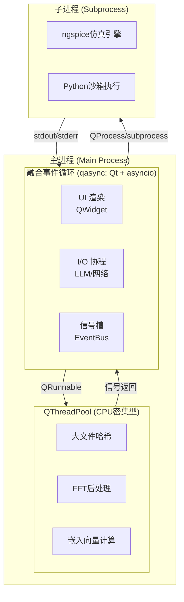

---

## 3.5 三层状态分离架构

> **核心设计决策**：彻底解决"多头马车"状态不一致问题，采用单向数据流架构

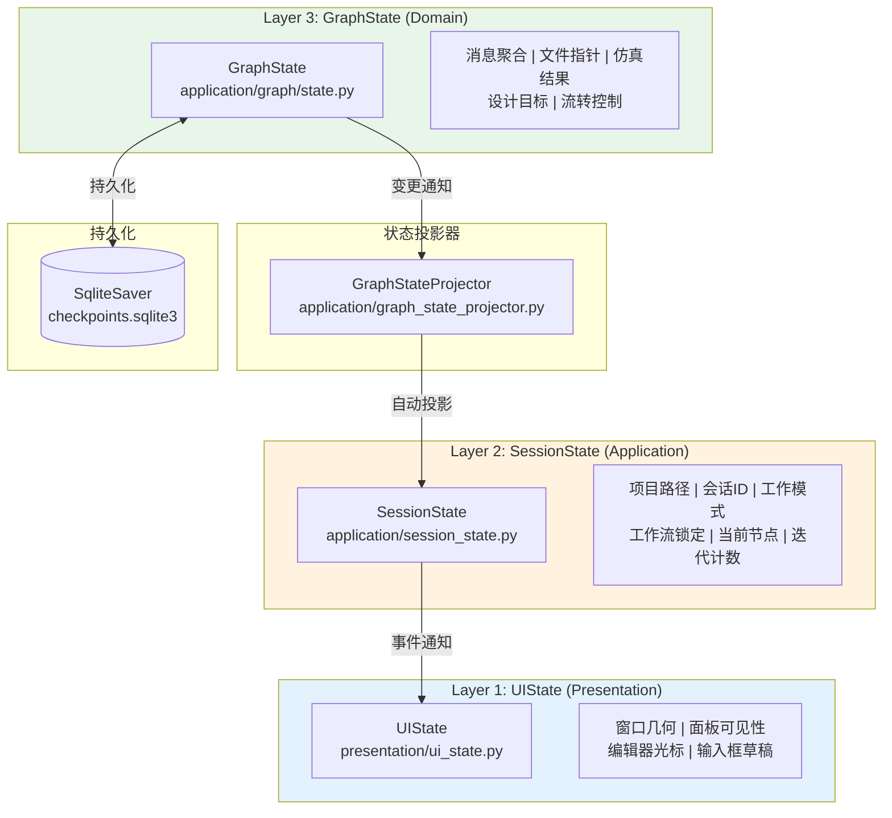

**单向数据流规则**：
- UI 组件只读 SessionState，禁止直接访问 GraphState
- 状态变更只能通过图节点执行，由 GraphStateProjector 自动投影
- 工作流锁定状态由 `current_node` 派生，不独立存储

---

## 4. 启动流程时序图

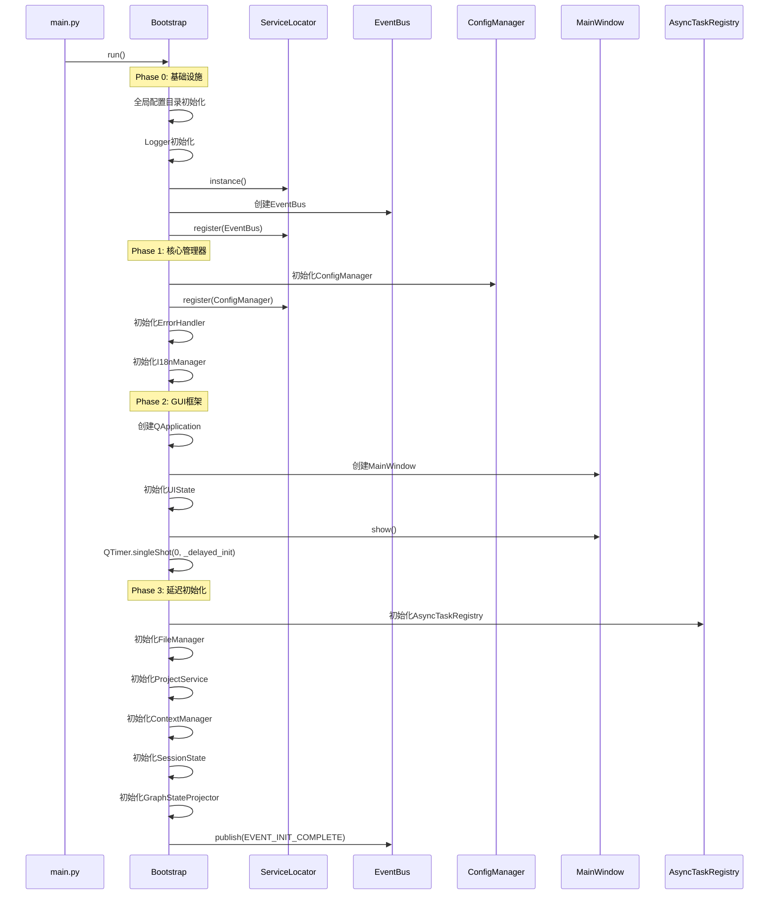

---

## 5. LangGraph 工作流架构

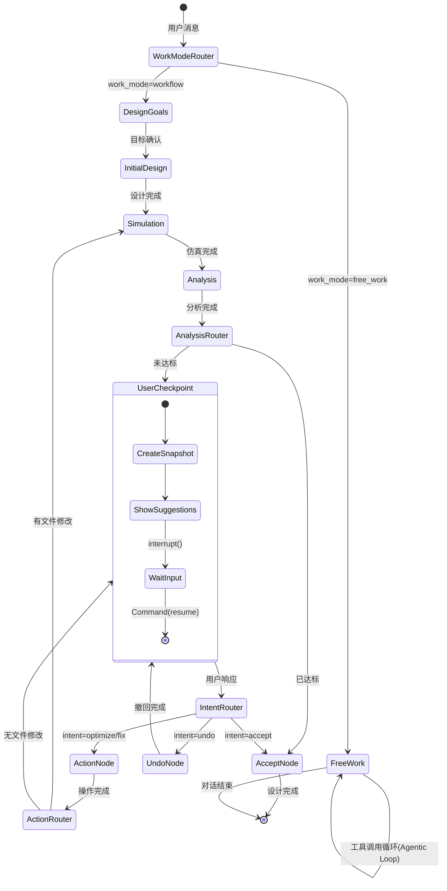

---

## 6. GraphState 单一数据源架构

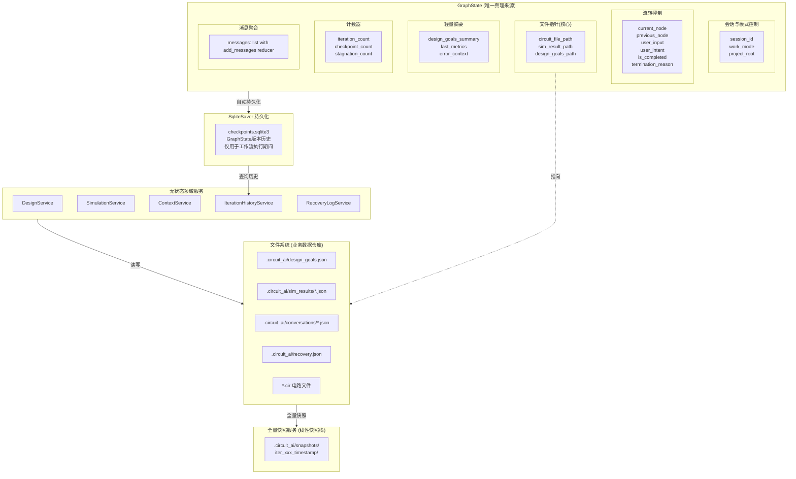

---

## 7. 仿真数据流图

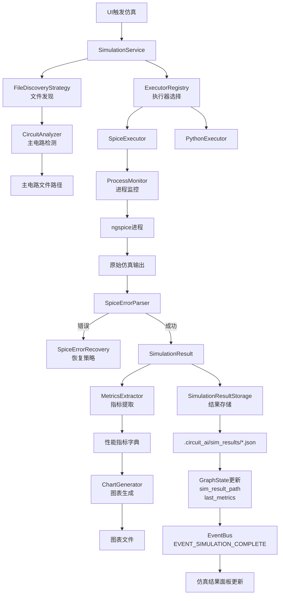

---

## 8. RAG 知识检索架构

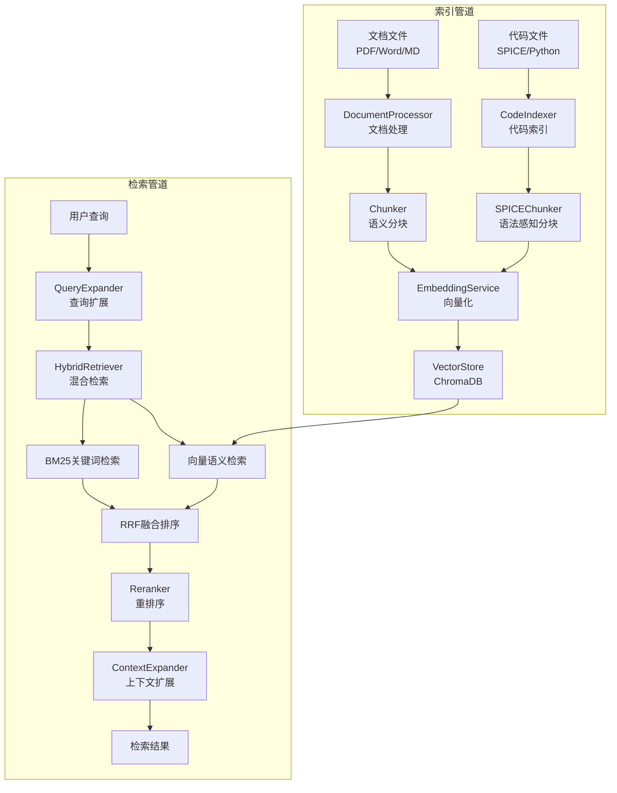

---

## 9. 工具执行框架

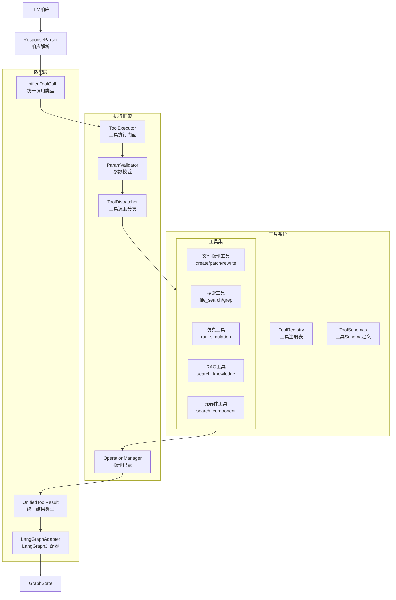

---

## 10. 人机协作流程

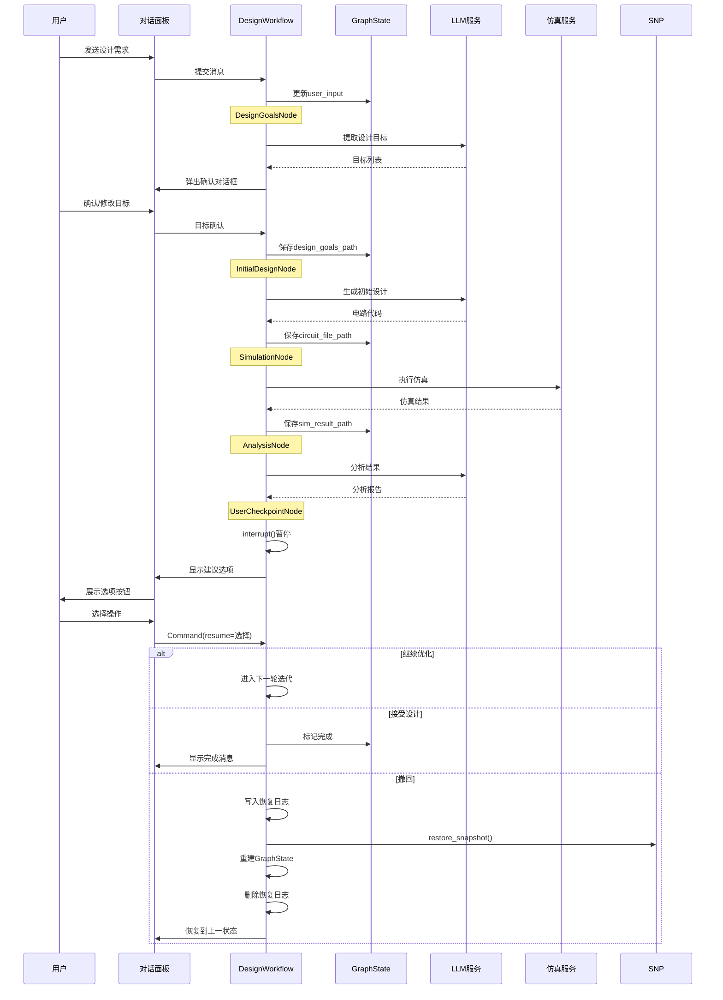

---

## 11. 事件总线通信架构

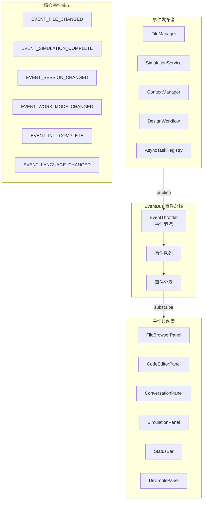

---

## 12. 追踪与可观测性架构

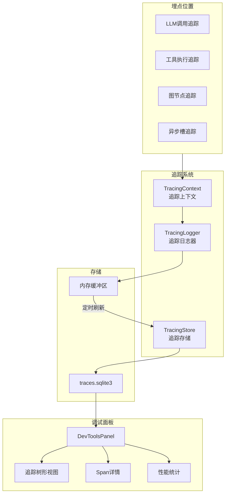

---

## 13. 主窗口布局结构

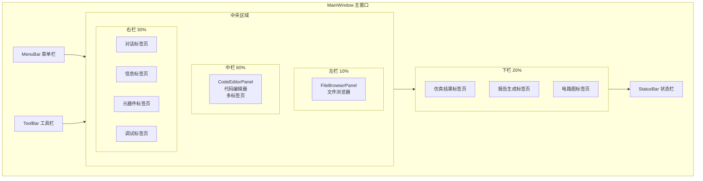

---

## 14. 文件操作降级策略

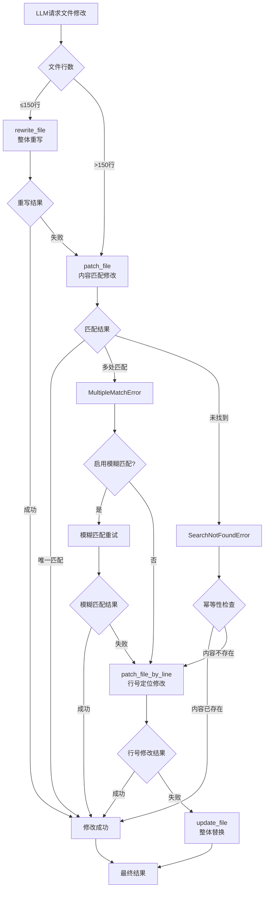

---

## 15. 开发阶段依赖关系

```mermaid
graph LR
    subgraph Phase1["阶段1: 基础设施"]
        P1A[项目骨架]
        P1B[配置管理]
        P1C[事件总线]
        P1D[主窗口框架]
    end

    subgraph Phase15["阶段1.5: 可观测性"]
        P15A[追踪上下文]
        P15B[追踪存储]
        P15C[调试面板]
    end

    subgraph Phase2["阶段2: 文件管理"]
        P2A[FileManager]
        P2B[文件浏览器]
        P2C[代码编辑器]
    end

    subgraph Phase25["阶段2.5: 状态管理"]
        P25A[GraphState设计]
        P25B[领域服务]
        P25C[快照服务]
    end

    subgraph Phase3["阶段3: LLM集成"]
        P3A[LLM客户端]
        P3B[上下文管理]
        P3C[对话面板]
    end

    subgraph Phase4["阶段4: 仿真引擎"]
        P4A[SPICE执行器]
        P4B[指标提取]
        P4C[图表生成]
    end

    subgraph Phase5["阶段5: RAG检索"]
        P5A[嵌入服务]
        P5B[向量存储]
        P5C[检索服务]
    end

    subgraph Phase6["阶段6: 工具系统"]
        P6A[工具注册表]
        P6B[工具执行器]
        P6C[响应解析]
    end

    subgraph Phase7["阶段7: 工作流编排"]
        P7A[图节点]
        P7B[条件边]
        P7C[检查点]
    end

    subgraph Phase8["阶段8: 人机协作"]
        P8A[建议选项]
        P8B[撤回机制]
        P8C[行动处理]
    end

    subgraph Phase9["阶段9: 集成验证"]
        P9A[端到端测试]
        P9B[信息面板]
    end

    subgraph Phase10["阶段10: 元器件"]
        P10A[商城适配器]
        P10B[BOM分析]
    end

    Phase1 --> Phase15
    Phase15 --> Phase2
    Phase2 --> Phase25
    Phase25 --> Phase3
    Phase3 --> Phase4
    Phase4 --> Phase5
    Phase5 --> Phase6
    Phase6 --> Phase7
    Phase7 --> Phase8
    Phase8 --> Phase9
    Phase9 --> Phase10

    %% 跨阶段依赖
    Phase1 -.-> Phase3
    Phase1 -.-> Phase4
    Phase2 -.-> Phase6
    Phase3 -.-> Phase7
    Phase4 -.-> Phase7
    Phase5 -.-> Phase7
    Phase25 -.-> Phase7
    Phase25 -.-> Phase8
```

---

## 16. 目录结构总览

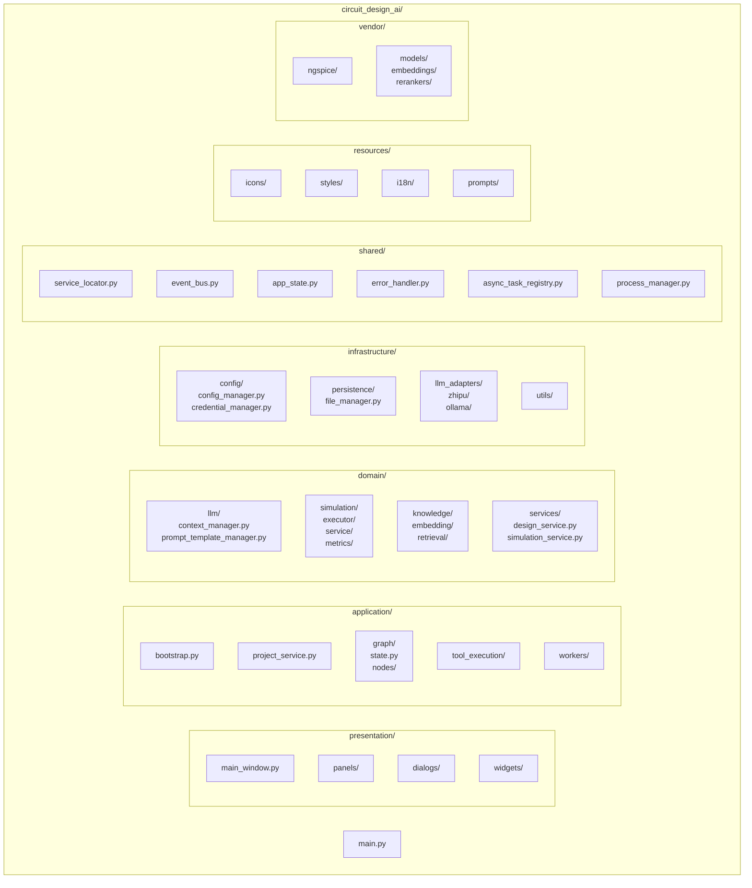

---

## 17. LLM 客户端架构

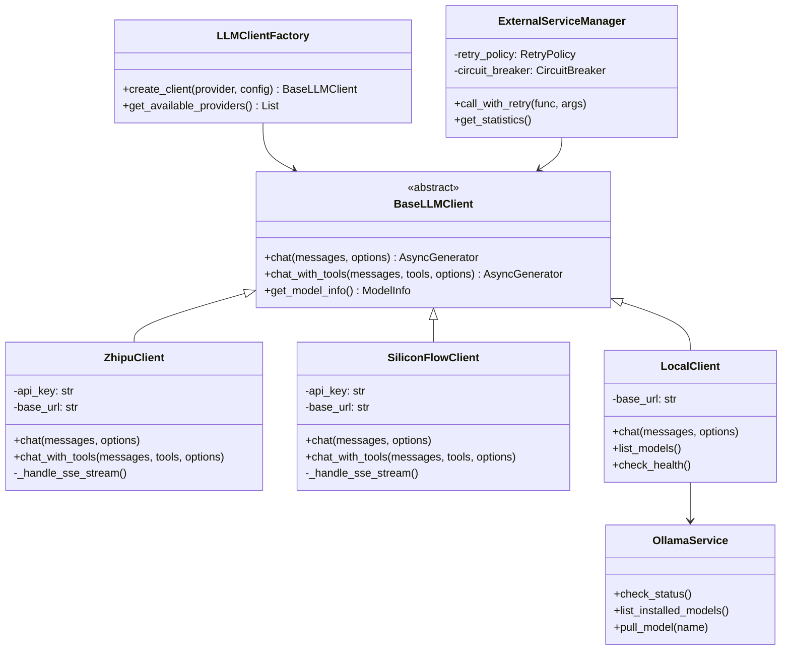

---

## 18. 服务定位器模式

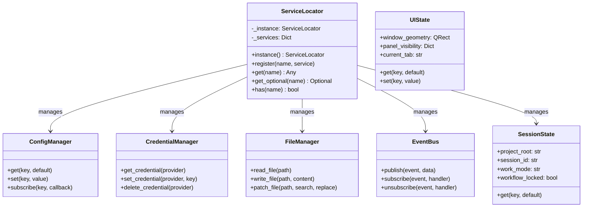

---

## 总结

本架构图文档涵盖了电路AI设计助理项目的核心架构设计：

1. **四层架构**：表示层、应用层、领域层、基础设施层 + 共享内核
2. **并发模型**：qasync融合事件循环 + QThreadPool + 子进程隔离
3. **三层状态分离**：UIState（纯UI状态）→ SessionState（业务状态投影）→ GraphState（唯一真理来源）
4. **单向数据流**：GraphState → GraphStateProjector → SessionState → UI组件
5. **工作流编排**：LangGraph StateGraph + 条件边路由 + interrupt/Command机制
6. **工具系统**：统一工具注册 + 适配层 + 降级策略
7. **可观测性**：追踪上下文 + 追踪存储 + 调试面板

所有架构图均使用 Mermaid 语法，可直接在支持 Mermaid 的 Markdown 查看器中渲染。


---

## 19. 停止控制器架构

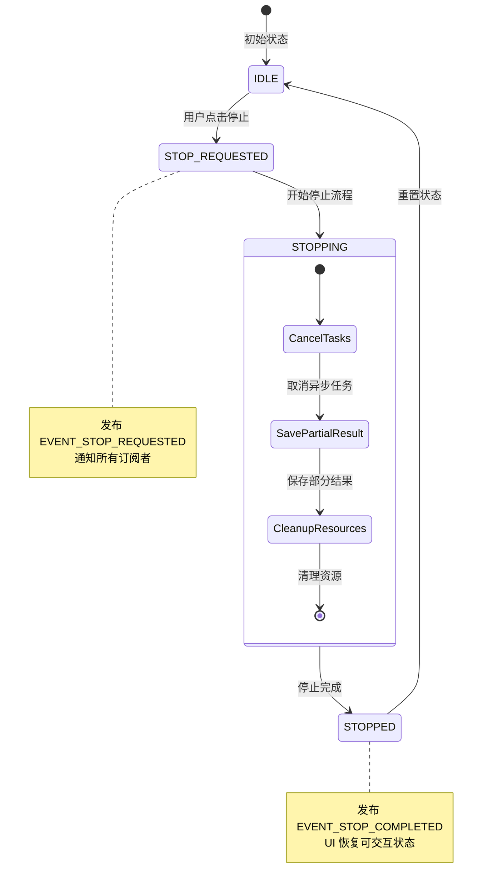

---

## 20. 会话管理架构

```mermaid
graph TB
    subgraph SessionManagement["会话管理"]
        CS[ContextService<br/>对话历史读写服务<br/>无状态]
        MS[MessageStore<br/>消息存储与持久化]
        TC[TokenCounter<br/>Token计数工具]
    end

    subgraph Storage["存储层"]
        SI[.circuit_ai/conversations/<br/>sessions.json<br/>会话索引]
        SF[.circuit_ai/conversations/<br/>{session_name}.json<br/>会话文件]
    end

    subgraph GraphStateRef["GraphState引用"]
        GS[GraphState.session_id<br/>会话标识引用]
    end

    subgraph UI["UI层"]
        CP[ConversationPanel<br/>对话面板]
        CVM[ConversationViewModel<br/>ViewModel]
        HD[HistoryDialog<br/>历史对话框]
    end

    CS --> MS
    CS --> TC
    MS --> SI
    MS --> SF
    GS -.->|引用| SF
    
    CVM --> CS
    CP --> CVM
    HD --> CS
    
    CS -->|EVENT_SESSION_CHANGED| CVM
    CVM -->|更新显示| CP
```

---

## 21. LLM 客户端适配层架构

```mermaid
graph TB
    subgraph UnifiedInterface["统一接口层"]
        BLC[BaseLLMClient<br/>抽象基类]
        URT[UnifiedResponseTypes<br/>统一响应类型]
    end

    subgraph Adapters["适配器层"]
        subgraph Zhipu["智谱适配器"]
            ZC[ZhipuClient]
            ZRB[ZhipuRequestBuilder]
            ZRP[ZhipuResponseParser]
            ZSH[ZhipuStreamHandler]
        end
        
        subgraph SiliconFlow["硅基流动适配器"]
            SFC[SiliconFlowClient]
            SFRB[SiliconFlowRequestBuilder]
            SFSH[SiliconFlowStreamHandler]
        end
        
        subgraph Local["本地模型适配器"]
            LC[LocalClient]
            OS[OllamaService]
            LSH[LocalStreamHandler]
        end
    end

    subgraph ResponseAdapters["响应适配层"]
        RA[ResponseAdapter<br/>适配器基类]
        ZRA[ZhipuResponseAdapter]
        SFRA[SiliconFlowResponseAdapter]
        LRA[LocalResponseAdapter]
    end

    BLC --> ZC
    BLC --> SFC
    BLC --> LC
    
    ZC --> ZRB
    ZC --> ZRP
    ZC --> ZSH
    
    SFC --> SFRB
    SFC --> SFSH
    
    LC --> OS
    LC --> LSH
    
    RA --> ZRA
    RA --> SFRA
    RA --> LRA
    
    ZRP --> ZRA
    SFSH --> SFRA
    LSH --> LRA
    
    ZRA --> URT
    SFRA --> URT
    LRA --> URT
```

---

## 22. 检查点与撤回机制

```mermaid
sequenceDiagram
    participant User as 用户
    participant WF as DesignWorkflow
    participant GS as GraphState
    participant SQL as SqliteSaver
    participant SNP as SnapshotService
    participant FS as 文件系统

    Note over WF: 创建检查点
    WF->>SNP: create_snapshot(checkpoint_id)
    SNP->>FS: shutil.copytree()
    SNP-->>WF: snapshot_path
    WF->>SQL: 自动保存 GraphState
    WF->>WF: interrupt() 暂停

    Note over User: 用户请求撤回
    User->>WF: Command(resume="undo")
    
    Note over WF: 执行撤回
    WF->>SQL: get_checkpoint(prev_id)
    SQL-->>WF: 旧 GraphState
    WF->>GS: 恢复状态
    Note over GS: 文件指针自动回退
    
    WF->>SNP: restore_snapshot(prev_id)
    SNP->>FS: 恢复文件内容
    SNP-->>WF: 恢复完成
    
    WF->>User: 显示撤回成功
```

---

## 23. 建议选项消息流程

```mermaid
flowchart TB
    START[迭代完成] --> GEN[SuggestionGenerator<br/>生成建议选项]
    
    GEN --> CHECK{检查状态}
    CHECK -->|仿真失败| ERR[高亮"修复错误"]
    CHECK -->|达标| ACC[高亮"接受设计"]
    CHECK -->|未达标| OPT[高亮"继续优化"]
    
    ERR --> MSG[创建建议消息]
    ACC --> MSG
    OPT --> MSG
    
    MSG --> UI[显示在对话面板]
    
    UI --> INPUT{用户操作}
    INPUT -->|点击按钮| BTN[按钮变为已选择]
    INPUT -->|自由输入| TXT[按钮变为过期]
    
    BTN --> ROUTE[路由到对应处理器]
    TXT --> ACTION[进入action_node]
    
    ROUTE --> EXEC[执行预设操作]
    ACTION --> LLM[LLM自主决策]
    
    EXEC --> NEXT[下一步流程]
    LLM --> NEXT
```

---

## 24. 嵌入模型与向量存储架构

```mermaid
graph TB
    subgraph EmbeddingLayer["嵌入服务层"]
        ES[EmbeddingService<br/>嵌入服务门面]
        
        subgraph LocalEmbed["本地嵌入"]
            ML[ModelLoader<br/>模型加载器]
            LEC[LocalEmbeddingClient]
            GTE[GTE-ModernBERT<br/>768维]
        end
        
        subgraph OnlineEmbed["线上嵌入"]
            OEC[OnlineEmbeddingClient]
            ZE[智谱Embedding-3]
        end
        
        BE[BatchEmbedder<br/>批量处理]
    end

    subgraph VectorLayer["向量存储层"]
        VS[VectorStore<br/>向量存储门面]
        CM[CollectionManager<br/>集合管理]
        IU[IncrementalUpdater<br/>增量更新]
        QC[QueryCache<br/>查询缓存]
        
        CDB[(ChromaDB<br/>持久化存储)]
    end

    ES --> LEC
    ES --> OEC
    LEC --> ML
    ML --> GTE
    ES --> BE
    
    VS --> CM
    VS --> IU
    VS --> QC
    CM --> CDB
    IU --> CDB
    QC --> CDB
    
    BE --> VS
```

---

## 25. 混合检索与重排序流程

```mermaid
flowchart TB
    QUERY[用户查询] --> QE[QueryExpander<br/>查询扩展]
    
    QE --> SYN[同义词扩展]
    QE --> TERM[电路术语提取]
    QE --> TRANS[中英文互译]
    
    SYN --> EQ[扩展查询列表]
    TERM --> EQ
    TRANS --> EQ
    
    EQ --> HYB[HybridSearcher<br/>混合检索]
    
    subgraph HybridSearch["混合检索"]
        VEC[向量语义检索<br/>ChromaDB]
        BM25[BM25关键词检索<br/>rank_bm25]
        RRF[RRF倒数排名融合]
    end
    
    HYB --> VEC
    HYB --> BM25
    VEC --> RRF
    BM25 --> RRF
    
    RRF --> RR[Reranker<br/>交叉编码器重排序]
    RR --> CTX[ContextExpander<br/>上下文扩展]
    
    CTX --> SW[滑动窗口扩展]
    CTX --> PC[父子分块扩展]
    CTX --> SB[语义边界扩展]
    
    SW --> RESULT[最终检索结果]
    PC --> RESULT
    SB --> RESULT
```

---

## 26. 代码索引增量更新流程

```mermaid
flowchart TB
    EVENT[文件变更事件] --> FW[FileWatcherWorker<br/>文件监听]
    
    FW --> FCH[FileChangeHandler<br/>变更处理]
    
    FCH --> FILTER{过滤检查}
    FILTER -->|忽略文件| SKIP[跳过]
    FILTER -->|有效文件| DI[DebouncedIndexer<br/>防抖调度]
    
    DI --> WAIT[500ms防抖延迟]
    WAIT --> MERGE[合并同文件变更]
    
    MERGE --> CI[CodeIndexer<br/>代码索引器]
    
    CI --> HASH[计算SHA256哈希]
    HASH --> CMP{哈希比对}
    
    CMP -->|相同| SKIP2[跳过索引]
    CMP -->|不同| CHUNK[语法感知分块]
    
    CHUNK --> SC[SpiceChunker<br/>.subckt边界]
    CHUNK --> PC[PythonChunker<br/>AST解析]
    
    SC --> EMB[嵌入向量化]
    PC --> EMB
    
    EMB --> UPSERT[VectorStore.upsert<br/>增量更新]
```

---

## 27. Agentic Loop 工具调用循环

```mermaid
stateDiagram-v2
    [*] --> ReceiveInput: 接收用户输入

    ReceiveInput --> CallLLM: 构建Prompt
    
    CallLLM --> ParseResponse: LLM响应
    
    ParseResponse --> CheckToolCalls: 解析响应
    
    state CheckToolCalls <<choice>>
    CheckToolCalls --> ExecuteTools: 有工具调用
    CheckToolCalls --> GenerateReply: 无工具调用
    
    ExecuteTools --> CollectResults: 执行工具
    CollectResults --> CheckIteration: 收集结果
    
    state CheckIteration <<choice>>
    CheckIteration --> CallLLM: 未达最大迭代
    CheckIteration --> ForceComplete: 达到最大迭代
    
    GenerateReply --> [*]: 返回最终回复
    ForceComplete --> [*]: 强制结束
    
    note right of ExecuteTools
        通过ToolExecutor执行
        支持并行执行多个工具
    end note
    
    note right of CheckIteration
        默认最大迭代: 10次
        防止无限循环
    end note
```

---

## 28. 仿真执行器策略模式

```mermaid
classDiagram
    class SimulationExecutor {
        <<abstract>>
        +get_name() str
        +get_supported_extensions() List
        +can_handle(file_path) bool
        +execute(file_path, config) SimulationResult
        +validate_file(file_path) bool
    }
    
    class SpiceExecutor {
        -ngspice_path: str
        +execute(file_path, config)
        +run_ac_analysis()
        +run_dc_analysis()
        +run_transient_analysis()
        +run_noise_analysis()
    }
    
    class PythonExecutor {
        -sandbox_config: dict
        +execute(file_path, config)
        -_run_in_subprocess()
        -_parse_output()
    }
    
    class ExecutorRegistry {
        -executors: Dict
        +register(executor)
        +get_executor(name)
        +get_executor_for_file(path)
        +get_all_executors()
    }
    
    class SimulationService {
        -registry: ExecutorRegistry
        +run_simulation(project, file, config)
        +run_pvt_analysis()
        +run_monte_carlo()
    }
    
    SimulationExecutor <|-- SpiceExecutor
    SimulationExecutor <|-- PythonExecutor
    ExecutorRegistry --> SimulationExecutor
    SimulationService --> ExecutorRegistry
```

---

## 29. 错误处理与恢复策略

```mermaid
flowchart TB
    ERROR[仿真错误] --> PARSE[SpiceErrorParser<br/>错误解析]
    
    PARSE --> TYPE{错误类型}
    
    TYPE -->|语法错误| SYN[提取行号和上下文]
    TYPE -->|模型缺失| MOD[提取缺失模型名]
    TYPE -->|节点浮空| NODE[提取浮空节点]
    TYPE -->|收敛失败| CONV[分析收敛原因]
    
    SYN --> SE[SimulationError<br/>结构化错误]
    MOD --> SE
    NODE --> SE
    CONV --> SE
    
    SE --> REC[SpiceErrorRecovery<br/>恢复策略]
    
    REC --> CHECK{可自动恢复?}
    
    CHECK -->|是| AUTO[应用恢复策略]
    CHECK -->|否| USER[返回用户建议]
    
    AUTO --> REDUCE[降低精度]
    AUTO --> STEP[减小时间步长]
    AUTO --> INIT[添加初始条件]
    
    REDUCE --> RETRY[重试仿真]
    STEP --> RETRY
    INIT --> RETRY
    
    USER --> GS[写入GraphState<br/>error_context]
    GS --> UI[UI显示错误<br/>高亮修复按钮]
```

---

## 30. 完整数据流总览

```mermaid
flowchart TB
    subgraph Input["输入层"]
        USER[用户输入]
        FILE[文件变更]
        BTN[按钮点击]
    end

    subgraph Workflow["工作流层"]
        GS[GraphState<br/>单一数据源]
        NODES[图节点]
        EDGES[条件边路由]
    end

    subgraph Services["服务层"]
        DS[DesignService]
        SS[SimulationService]
        CS[ContextService]
        RS[RAGService]
    end

    subgraph Tools["工具层"]
        TE[ToolExecutor]
        FM[FileManager]
        FSS[FileSearchService]
    end

    subgraph External["外部系统"]
        LLM[LLM API]
        NG[ngspice]
        CDB[ChromaDB]
        SQL[SQLite]
    end

    subgraph Output["输出层"]
        UI[UI更新]
        FILES[文件修改]
        REPORT[报告生成]
    end

    USER --> GS
    FILE --> GS
    BTN --> GS
    
    GS --> NODES
    NODES --> EDGES
    EDGES --> NODES
    
    NODES --> DS
    NODES --> SS
    NODES --> CS
    NODES --> RS
    
    NODES --> TE
    TE --> FM
    TE --> FSS
    
    DS --> SQL
    SS --> NG
    CS --> SQL
    RS --> CDB
    
    NODES --> LLM
    
    GS --> UI
    FM --> FILES
    SS --> REPORT
```


## 31. 元器件域架构

```mermaid
graph TB
    subgraph ComponentDomain["元器件域 (domain/component/)"]
        subgraph Models["数据模型"]
            COMP[Component<br/>元器件数据类]
            NS[NormalizedSpecs<br/>标准化规格]
            BOM[BOMItem<br/>BOM条目]
            SM[SpiceModel<br/>SPICE模型]
        end
        
        subgraph Normalizer["参数标准化层"]
            PN[ParameterNormalizer<br/>标准化入口]
            VP[ValueParser<br/>数值解析]
            UC[UnitConverter<br/>单位转换]
        end
        
        subgraph Service["服务层"]
            CS[ComponentService<br/>门面类]
            SS[SearchService<br/>搜索服务]
            BA[BOMAnalyzer<br/>BOM分析]
            MD[ModelDownloader<br/>模型下载]
        end
        
        subgraph Adapter["商城适配器"]
            BASE[BaseAdapter<br/>抽象基类]
            LCSC[LCSCAdapter<br/>嘉立创适配器]
            LRP[LCSCResponseParser<br/>响应解析]
        end
        
        subgraph Cache["缓存管理"]
            CC[ComponentCache<br/>元器件缓存]
            MC[ModelCache<br/>模型缓存]
        end
        
        subgraph Tools["LLM工具"]
            CT[ComponentTools<br/>工具Schema]
        end
    end

    CS --> SS
    CS --> BA
    CS --> MD
    CS --> CC
    
    SS --> LCSC
    SS --> PN
    
    LCSC --> LRP
    LCSC --> ESM[ExternalServiceManager]
    
    PN --> VP
    PN --> UC
    
    VP --> NS
    UC --> NS
    
    MD --> MC
    MD --> LCSC
    
    BA --> SS
    BA --> COMP
    BA --> BOM
    
    CT --> CS
```

---

## 32. 元器件查询数据流

```mermaid
flowchart TB
    START[LLM工具调用/用户搜索] --> CS[ComponentService.search]
    
    CS --> CACHE{缓存检查}
    CACHE -->|命中| RETURN[返回结果]
    CACHE -->|未命中| SS[SearchService.search]
    
    SS --> LCSC[LCSCAdapter.search]
    LCSC --> ESM[ExternalServiceManager.call]
    ESM --> API[嘉立创API请求]
    API --> LRP[LCSCResponseParser.parse]
    LRP --> RAW[原始Component列表]
    
    RAW --> PN[ParameterNormalizer.normalize_batch]
    PN --> VP[ValueParser<br/>解析数值单位]
    VP --> UC[UnitConverter<br/>转换基本单位]
    UC --> NS[NormalizedSpecs]
    
    NS --> NORM[标准化后Component列表]
    NORM --> SET[ComponentCache.set]
    SET --> RETURN
```

---

## 33. BOM分析数据流

```mermaid
flowchart TB
    TRIGGER[用户触发BOM分析] --> BA[BOMAnalyzer.analyze_circuit]
    
    BA --> CA[CircuitAnalyzer.extract_components]
    CA --> LIST[元器件清单<br/>R1=10K, C1=100nF...]
    
    LIST --> BATCH[ComponentService.batch_search]
    BATCH --> MATCH[匹配商城元器件<br/>已标准化]
    
    MATCH --> STOCK[库存检查]
    STOCK --> PRICE[价格查询]
    
    PRICE --> REPORT[生成BOM报告]
    
    REPORT --> RESULT[BOMReport<br/>总成本/库存状态/可用性摘要]
    
    RESULT --> EVENT[EventBus<br/>BOM_ANALYSIS_COMPLETE]
    EVENT --> UI[BOM对话框/信息面板]
```

---

## 34. SPICE模型获取流程

```mermaid
flowchart TB
    START[仿真前模型检查/LLM请求] --> MD[ModelDownloader.get_model]
    
    MD --> MC{ModelCache.get}
    MC -->|命中| LOCAL[返回本地模型路径]
    MC -->|未命中| DOWNLOAD[继续下载]
    
    DOWNLOAD --> LCSC[LCSCAdapter.get_spice_model]
    LCSC --> FILE[下载SPICE模型文件]
    
    FILE --> SAVE[保存到<br/>vendor/models/spice/]
    SAVE --> CACHE[ModelCache.set]
    CACHE --> LOCAL
    
    LOCAL --> INCLUDE[生成.include语句]
    INCLUDE --> SIM[供仿真使用]
```

---

## 35. 统一信息面板架构

```mermaid
graph TB
    subgraph InfoPanel["统一信息展示面板"]
        IPM[InfoPanelManager<br/>门面类]
        
        subgraph Collectors["信息收集器"]
            SIC[SimulationInfoCollector<br/>仿真信息]
            RIC[RAGInfoCollector<br/>RAG信息]
            CIC[ComponentInfoCollector<br/>元器件信息]
            OIC[OperationInfoCollector<br/>操作信息]
        end
        
        ICS[InfoCardStore<br/>信息存储]
        
        subgraph UI["UI组件"]
            UIP[UnifiedInfoPanel<br/>面板主组件]
            IPVM[InfoPanelViewModel<br/>ViewModel]
            TABS[CategoryTabs<br/>类别标签页]
            CARDS[InfoCards<br/>信息卡片]
        end
    end

    IPM --> SIC
    IPM --> RIC
    IPM --> CIC
    IPM --> OIC
    
    SIC --> ICS
    RIC --> ICS
    CIC --> ICS
    OIC --> ICS
    
    ICS --> IPVM
    IPVM --> UIP
    UIP --> TABS
    UIP --> CARDS
    
    subgraph Events["事件源"]
        E1[SIMULATION_COMPLETE]
        E2[SEARCH_COMPLETE]
        E3[BOM_ANALYSIS_COMPLETE]
        E4[OPERATION_RECORDED]
    end
    
    E1 --> SIC
    E2 --> RIC
    E2 --> CIC
    E3 --> CIC
    E4 --> OIC
```

---

## 36. 信息面板数据流

```mermaid
flowchart TB
    subgraph Sources["事件源"]
        SIM[仿真服务]
        RAG[RAG服务]
        COMP[元器件服务]
        TOOL[工具执行器]
    end

    subgraph EventBus["事件总线"]
        EB[EventBus]
    end

    subgraph Collectors["收集器层"]
        SIC[SimulationInfoCollector]
        RIC[RAGInfoCollector]
        CIC[ComponentInfoCollector]
        OIC[OperationInfoCollector]
    end

    subgraph Storage["存储层"]
        ICS[InfoCardStore]
    end

    subgraph ViewModel["ViewModel层"]
        IPVM[InfoPanelViewModel]
    end

    subgraph UI["UI层"]
        UIP[UnifiedInfoPanel]
    end

    SIM -->|发布事件| EB
    RAG -->|发布事件| EB
    COMP -->|发布事件| EB
    TOOL -->|发布事件| EB
    
    EB -->|订阅| SIC
    EB -->|订阅| RIC
    EB -->|订阅| CIC
    EB -->|订阅| OIC
    
    SIC -->|创建卡片| ICS
    RIC -->|创建卡片| ICS
    CIC -->|创建卡片| ICS
    OIC -->|创建卡片| ICS
    
    ICS -->|通知更新| IPVM
    IPVM -->|格式化数据| UIP
    UIP -->|渲染| CARDS[信息卡片]
```

---

## 37. 信息卡片类型层次

```mermaid
classDiagram
    class BaseInfoCard {
        <<abstract>>
        +card_id: str
        +category: InfoCategory
        +title: str
        +timestamp: str
        +set_data(card)
        +get_copyable_text()
        +get_exportable_data()
        +toggle_expand()
    }
    
    class SimulationCard {
        +analysis_type: str
        +duration: float
        +success: bool
        +show_charts()
        +export_data()
    }
    
    class MetricsCard {
        +metrics: Dict
        +targets: Dict
        +compare_history()
        +export_report()
    }
    
    class RAGStatusCard {
        +doc_count: int
        +chunk_count: int
        +last_updated: str
        +refresh_index()
    }
    
    class SearchResultCard {
        +results: List
        +scores: List
        +open_document()
        +copy_reference()
    }
    
    class ComponentCard {
        +part_number: str
        +specs: Dict
        +stock_status: str
        +view_detail()
    }
    
    class BOMCard {
        +total_cost: float
        +availability: Dict
        +export_csv()
    }
    
    class OperationCard {
        +operation_type: str
        +file_path: str
        +diff_summary: str
        +view_diff()
        +undo_operation()
    }
    
    BaseInfoCard <|-- SimulationCard
    BaseInfoCard <|-- MetricsCard
    BaseInfoCard <|-- RAGStatusCard
    BaseInfoCard <|-- SearchResultCard
    BaseInfoCard <|-- ComponentCard
    BaseInfoCard <|-- BOMCard
    BaseInfoCard <|-- OperationCard
```

---

## 38. 端到端集成验证流程

```mermaid
flowchart TB
    subgraph Preparation["验证准备"]
        ENV[环境检查<br/>LLM/ngspice/SQLite]
        DATA[测试数据准备<br/>电路文件/设计目标]
        LOG[日志配置]
    end

    subgraph UnitLevel["单元级验证"]
        U1[各模块内部功能]
    end

    subgraph InterfaceLevel["接口级验证"]
        I1[工具执行链路]
        I2[工作流流转]
        I3[检查点机制]
    end

    subgraph E2ELevel["端到端验证"]
        E1[场景1: BJT放大器设计]
        E2[场景2: 复杂运放多文件]
        E3[场景3: 撤回操作]
        E4[场景4: 错误修复]
        E5[场景5: 上下文续接]
        E6[场景6: Agentic Loop]
    end

    subgraph ExceptionLevel["异常级验证"]
        X1[网络异常]
        X2[仿真异常]
        X3[文件异常]
    end

    subgraph Performance["性能验证"]
        P1[响应时间]
        P2[资源占用]
    end

    subgraph Report["验证报告"]
        R1[通过项记录]
        R2[失败项记录]
        R3[改进建议]
    end

    Preparation --> UnitLevel
    UnitLevel --> InterfaceLevel
    InterfaceLevel --> E2ELevel
    E2ELevel --> ExceptionLevel
    ExceptionLevel --> Performance
    Performance --> Report
```

---

## 39. Agentic Loop 护栏机制

```mermaid
flowchart TB
    START[Agentic Loop开始] --> ITER[迭代计数器]
    
    ITER --> CHECK1{迭代次数检查}
    CHECK1 -->|<10| CONTINUE[继续执行]
    CHECK1 -->|=10| WARN[IterationWarner<br/>注入警告消息]
    CHECK1 -->|>15| FORCE[强制终止]
    
    WARN --> CONTINUE
    
    CONTINUE --> TOOL[执行工具调用]
    
    TOOL --> CHECK2{执行结果}
    CHECK2 -->|成功| RESET[重置失败计数]
    CHECK2 -->|失败| TRACK[FailureTracker<br/>记录失败]
    
    TRACK --> CHECK3{同一操作失败次数}
    CHECK3 -->|<3| RETRY[允许重试]
    CHECK3 -->|>=3| BLOCK[阻止操作<br/>返回建议]
    
    RESET --> NEXT[下一轮迭代]
    RETRY --> NEXT
    BLOCK --> NEXT
    
    NEXT --> SIM{是否仿真操作}
    SIM -->|是| STAG[StagnationDetector<br/>停滞检测]
    SIM -->|否| ITER
    
    STAG --> CHECK4{连续3次无进展}
    CHECK4 -->|是| HINT[注入停滞提示]
    CHECK4 -->|否| ITER
    
    HINT --> ITER
    
    FORCE --> END[返回最终结果]
```

---

## 40. 仿真结果历史对比流程（analysis_node）

```mermaid
flowchart TB
    SIM[仿真完成] --> RESULT[SimulationResult]
    
    RESULT --> ANALYSIS[analysis_node]
    
    ANALYSIS --> HIST[获取历史指标趋势<br/>IterationHistoryService.get_metrics_trend]
    
    HIST --> CMP{有历史数据?}
    CMP -->|否| BASIC[仅使用当前指标]
    CMP -->|是| COMPARE[计算对比信息]
    
    COMPARE --> CALC[计算差值和变化率]
    CALC --> FORMAT[格式化对比字符串]
    
    FORMAT --> EXAMPLE["增益: 18.5dB<br/>(上次: 17.5dB, ↑+1.0dB)"]
    
    EXAMPLE --> CONTEXT[作为 LLM 上下文]
    BASIC --> CONTEXT
    
    CONTEXT --> LLM[LLM 分析并生成改进建议]
    LLM --> STAG[check_stagnation 判断停滞]
    STAG --> UPDATE[更新 GraphState]
```

---

## 41. 冷启动初始化流程

```mermaid
sequenceDiagram
    participant Main as main.py
    participant BS as Bootstrap
    participant SL as ServiceLocator
    participant CFG as ConfigManager
    participant CRED as CredentialManager
    participant FM as FileManager
    participant LLM as LLMClient
    participant SIM as SimulationService
    participant RAG as RAGService

    Note over Main: 冷启动 - 无缓存状态
    
    Main->>BS: run()
    
    Note over BS: Phase 0: 基础设施
    BS->>BS: 创建全局配置目录<br/>~/.circuit_design_ai/
    BS->>BS: 初始化Logger
    BS->>SL: instance()
    
    Note over BS: Phase 1: 核心管理器
    BS->>CFG: 初始化(创建默认配置)
    CFG-->>BS: 配置就绪
    BS->>CRED: 初始化(检查API Key)
    CRED-->>BS: 凭证状态
    
    Note over BS: Phase 2: GUI框架
    BS->>BS: 创建QApplication
    BS->>BS: 创建MainWindow
    BS->>BS: show()
    
    Note over BS: Phase 3: 延迟初始化
    BS->>FM: 初始化FileManager
    BS->>LLM: 初始化LLMClient
    LLM->>LLM: 验证API连接
    BS->>SIM: 初始化SimulationService
    SIM->>SIM: 检测ngspice
    BS->>RAG: 初始化RAGService
    RAG->>RAG: 加载嵌入模型
    
    BS-->>Main: 初始化完成
```

---

## 42. 多文件电路项目结构

```mermaid
graph TB
    subgraph ProjectRoot["项目根目录"]
        MAIN[main.cir<br/>主电路文件]
        
        subgraph Subcircuits["subcircuits/"]
            SUB1[opamp_741.sub<br/>运放子电路]
            SUB2[bjt_model.sub<br/>BJT模型]
        end
        
        subgraph Parameters["parameters/"]
            PARAM[design_params.inc<br/>设计参数]
        end
        
        subgraph CircuitAI[".circuit_ai/"]
            DG[design_goals.json<br/>设计目标]
            IH[iteration_history.json<br/>迭代历史]
            
            subgraph SimResults["sim_results/"]
                SR1[result_001.json]
                SR2[result_002.json]
            end
            
            subgraph Snapshots["snapshots/"]
                SNP1[checkpoint_001/]
                SNP2[checkpoint_002/]
            end
        end
    end

    MAIN -->|.include| SUB1
    MAIN -->|.include| SUB2
    MAIN -->|.include| PARAM
    
    DG -.->|引用| MAIN
    IH -.->|记录| SR1
    IH -.->|记录| SR2
```

---

## 43. 参数标准化处理流程

```mermaid
flowchart TB
    RAW[原始参数<br/>"10uF", "10u", "10 microfarad"]
    
    RAW --> VP[ValueParser]
    
    VP --> PARSE{解析类型}
    PARSE -->|电阻| PR[parse_resistance]
    PARSE -->|电容| PC[parse_capacitance]
    PARSE -->|电感| PL[parse_inductance]
    PARSE -->|电压| PV[parse_voltage]
    PARSE -->|容差| PT[parse_tolerance]
    
    PR --> PV1[ParsedValue<br/>numeric=10000, unit=Ω]
    PC --> PV2[ParsedValue<br/>numeric=10, unit=µF]
    PL --> PV3[ParsedValue<br/>numeric=100, unit=µH]
    PV --> PV4[ParsedValue<br/>numeric=50, unit=V]
    PT --> PV5[ParsedValue<br/>numeric=1, unit=%]
    
    PV1 --> UC[UnitConverter]
    PV2 --> UC
    PV3 --> UC
    PV4 --> UC
    PV5 --> UC
    
    UC --> CONV{转换基本单位}
    CONV -->|to_ohms| O[10000 Ω]
    CONV -->|to_farads| F[1e-5 F]
    CONV -->|to_henries| H[1e-4 H]
    CONV -->|to_volts| V[50 V]
    
    O --> NS[NormalizedSpecs]
    F --> NS
    H --> NS
    V --> NS
    
    NS --> DISPLAY[格式化显示<br/>"10kΩ", "10µF"]
```
